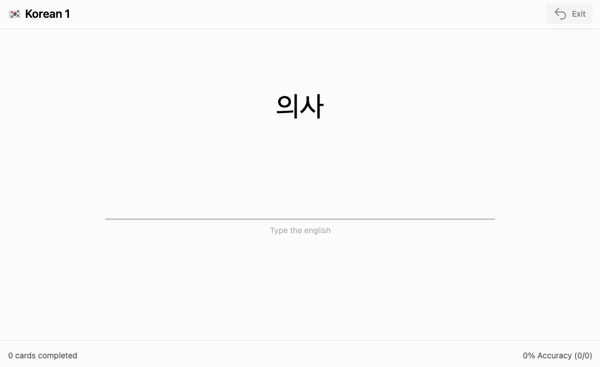
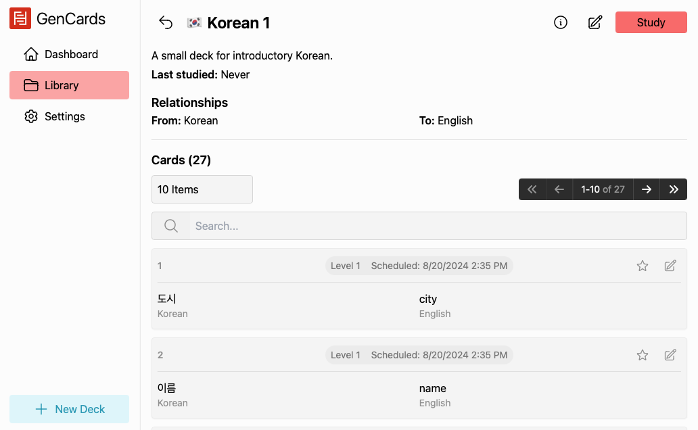

<h1 align="center">
  
</h1>

Open-source, local flashcard system with a custom spaced repetition advisor. Part of the [Gengoko project](https://gengoko.com).

## Overview

While spaced repetition is great for some people and situations, it isn't a universal solution. Spaced repeition demands that study every day, have a consistent level of motivation, and that you don't prioritize one card over another. Furthermore, most spaced repetition algorithms require user input to determine how well you know a card. This can cause problems by slowing down the process of studying and by encouraging non-active studying.

GenCards is designed around the concept of a **spaced advisor**. Instead of forcing you to study cards at a specific time, the spaced advisor merely determines an order in which you should study cards. This means that you can click the "study" button and learn in an optimal order without having to worry about when you should study. You can sit down and study for 5 minute or 5 hours, take breaks, or introduce new cards at any time. The spaced advisor will always be there to help you study in the most efficient way possible.

Additionally, GenCards requires text input instead of just click a button. This forces you to actively recall the information, and ensures you don't have to make any decisions about how well you know a card. This makes studying both more active and more efficient. You can also prioritize cards to tell the spaced advisor which cards are most important to you.

For a full explanation of the spaced advisor, see this blog post (coming soon). For a technical overview of the process of building the app, see this blog post (coming soon).

## Installation

To install, go to the [releases page](https://github.com/joshuamotoaki/gen-cards/releases) and download the latest version for your operating system. Extract the files and run the executable.

If you would like to build the application from the source code, first follow the [instructions](https://tauri.app/v1/guides/getting-started/prerequisites) on the Tauri website to install the necessary dependencies. Then, clone the repository and run `npm install` to install the necessary dependencies. Finally, run `npm run tauri build` to build the app.

## Technologies

GenCards is built using [Tauri](https://tauri.app/) -- a Rust-based framework for building desktop applications with web frameworks. The UI is built using [Svelte](https://svelte.dev/) and [SkeletonUI](https://www.skeleton.dev/), and the app uses [SQLite](https://www.sqlite.org/index.html) for data storage.

## Roadmap

While the app is currently functional (as a proof-of-concept), there is still quite a bit of work to be done to make it production-ready:

- [ ] Conflict detection for cards
- [ ] Multi-answer support
- [ ] Persist deck on refresh (or disable refreshing altogether)
- [ ] Section in the settings to modify the parameters of the spaced advisor
- [ ] Anki imports
- [ ] Tags for cards
- [ ] Better filtering in the card list
- [ ] Improved UI
- [ ] More detailed statistics
- [ ] Better dashboard

## License

This project is licensed under the MIT License - see the [LICENSE.md](LICENSE.md) file for details.

## Screenshots

Study Page

Deck View

